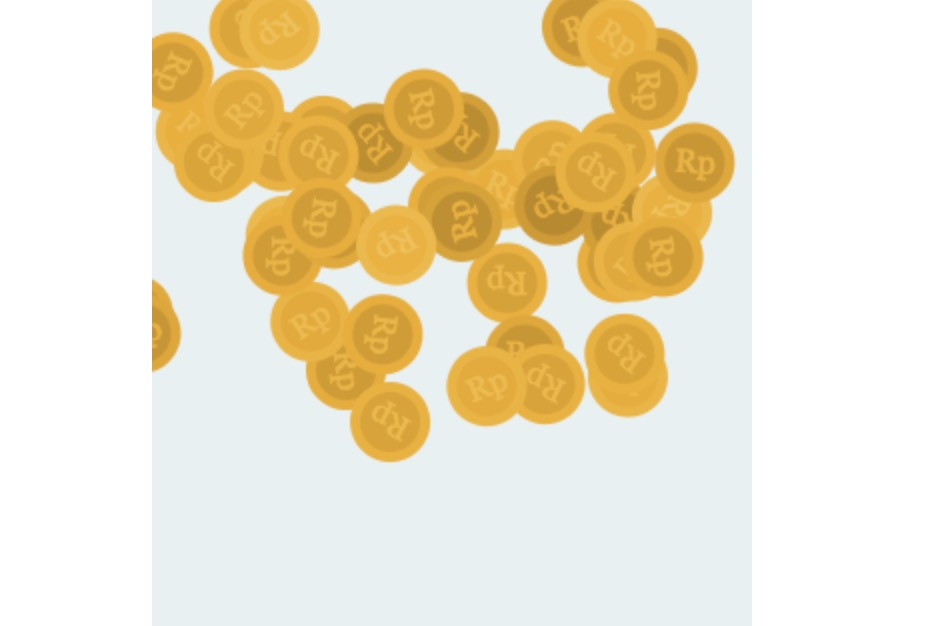

canvas - 撒金币动画
====

### 效果



``` html
<div class="wrap"></div>
```

### 代码

``` css
.wrap {
  position: relative;
  width: 300px;
  height: 500px;
  border-radius: 2px;
  background-color: #E7F0F2;
  margin: auto;
  box-sizing: border-box;
}

.canvas {
  position: absolute;
  top: 0px;
  left: 0px;
}
```


``` js
import $ from 'jquery'

let coins = []

let requestFrame = (function () {
  return window.requestAnimationFrame ||
    window.webkitRequestAnimationFrame ||
    window.mozRequestAnimationFrame ||
    function (callback) {
      window.setTimeout(callback, 1000 / 60)
    }
})()

class Coin {
  constructor(context, spawnArea) {
    this.context = context
    this.spawnArea = spawnArea

    this.coinRadius = 20
    this.halfCoinRadius = this.coinRadius / 2

    let coinRadius = this.coinRadius
    // 初始位置
    this.x = (Math.random() * spawnArea.width)
    this.y = -(Math.random() * coinRadius * 8)
    // 初始旋转角度
    this.r = Math.random() * (Math.PI * 2)
    // 每阶段变化的位移和角度
    this.vx = (Math.random() * 1) - 0.5
    this.vy = (Math.random() * 2) + 2.5
    this.vr = (Math.random() * 0.2) - 0.1

    this.id = coins.length
    coins.push(this)
  }

  draw() {
    const { context, spawnArea, coinRadius, halfCoinRadius } = this
    this.x += this.vx
    this.y += this.vy
    this.r += this.vr
    // 清除区域外金币
    if (this.y > spawnArea.height + coinRadius * 2) {
      coins[this.id] = undefined
    }

    context.save()
    // 位移
    context.translate(this.x - halfCoinRadius, this.y - halfCoinRadius)
    // 旋转
    context.rotate(this.r)
    // 控制明度
    var l = 43 + this.r

    // 创建金币外圆
    context.beginPath()
    context.arc(0, 0, coinRadius, 0, 2 * Math.PI)
    context.fillStyle = 'hsl(42, 89%, ' + (l + 5) + '%)'
    context.fill()
    context.closePath()
    // 创建金币外圆
    context.beginPath()
    context.arc(0, 0, coinRadius - 5, 0, 2 * Math.PI)
    context.fillStyle = 'hsl(42, 89%, ' + l + '%)'
    context.fill()
    context.closePath()
    // 设置金币文字
    context.font = "16px Georgia"
    context.fillStyle = 'hsl(42, 89%, ' + (l + 10) + '%)'
    context.fillText("Rp", -10, 5)

    context.translate(-(this.x - halfCoinRadius), -(this.y - halfCoinRadius))
    // 将 canvas 恢复到最近的保存状态的方法
    context.restore()
  }
}

function dropCoins(wrapSelector, n = 40) {
  let $wrap = $(wrapSelector)
  let [width, height] = [$wrap.width(), $wrap.height()]
  let size = { x: width, y: height }
  let spawnArea = { width, height }

  let canvas = $('<canvas/>').attr({ width: size.x, height: size.y }).appendTo(wrapSelector)
  let context = canvas.get(0).getContext("2d")

  function loop() {
    // 清空金币区
    context.clearRect(0, 0, size.x, size.y)
    for (var i = 0; i < coins.length; i++) {
      if (coins[i] != undefined) {
        coins[i].draw()
      }
    }
    requestFrame(loop)
  }

  for (var i = 0; i < n; i++) {
    new Coin(context, spawnArea)
  }
  loop()
}

export default dropCoins

```

## 使用

``` js
dropCoins('.wrap', 50)
```